# zoom-public-domain-backgrounds
Some public domain backgrounds to liven up your Zoom calls.

To change your 'virtual background' in Zoom: 

* Preferences > Virtual Background > Choose Virtual Background > +

---

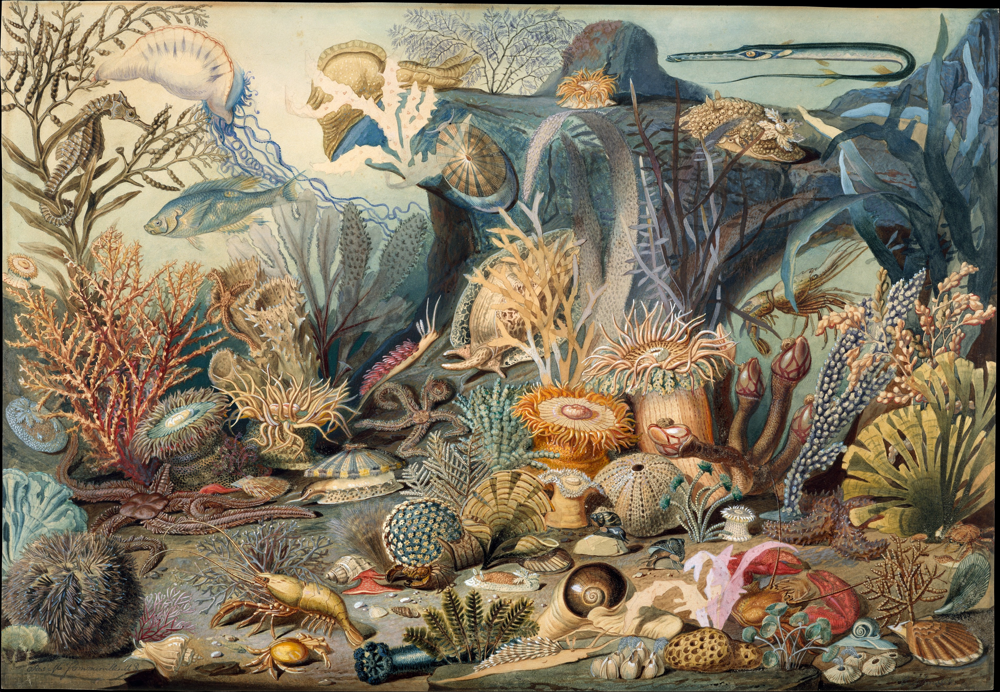
Artist: James M. Sommerville
Title: Ocean Life
Source: https://www.metmuseum.org/art/collection/search/12544
License: https://creativecommons.org/publicdomain/zero/1.0/
Filename: ocean_life.jpg

---

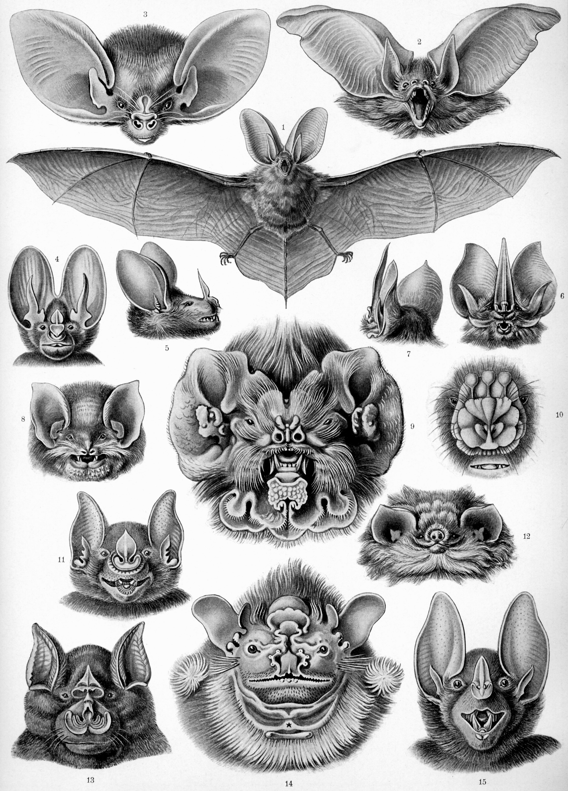
Artist: Ernst Haeckel
Title: Kunstformen der Natur (1904), plate 67: Chiroptera
Source: https://commons.wikimedia.org/wiki/Kunstformen_der_Natur#/media/File:Haeckel_Chiroptera.jpg
License: Public domain
Filename: Haeckel_Chiroptera.jpg

---

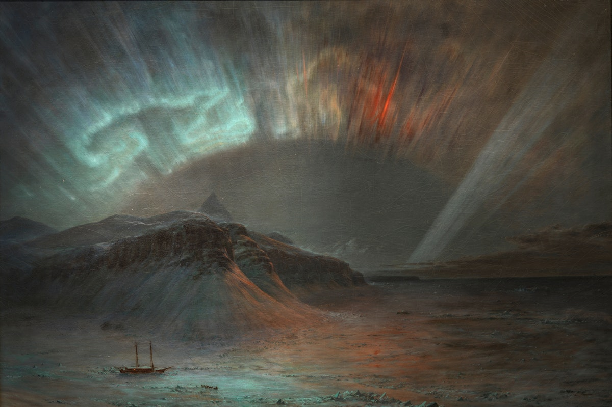
Artist: Frederic Edwin Church
Title: Aurora Borealis, 1865, oil on canvas, Smithsonian American Art Museum, Gift of Eleanor Blodgett, 1911.4.1
Source: https://americanart.si.edu/artwork/aurora-borealis-4806
License: Public domain
Filename: SAAM-1911.4.1_2-000001.jpg

---

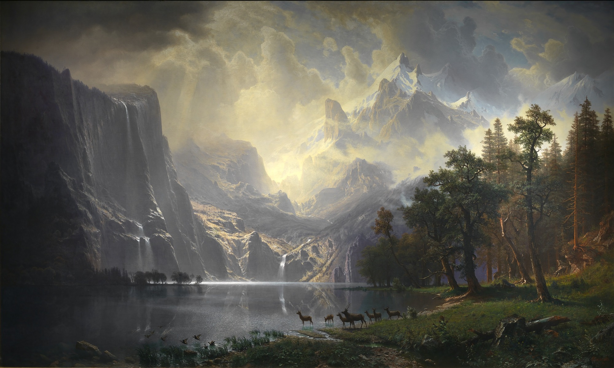
Artist: Albert Bierstadt
Title: Among the Sierra Nevada, California, 1868, oil on canvas
Source: https://americanart.si.edu/artwork/among-sierra-nevada-california-2059
License: Public domain
Filename: SAAM-1977.107.1_2.jpg

---

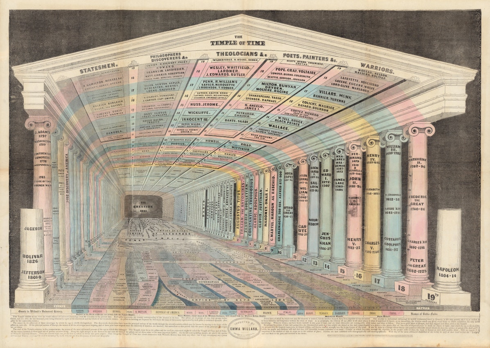
Artist: Emma Willard 
Title: The Temple of Time - 1846
Source: https://publicdomainreview.org/essay/emma-willard-maps-of-time
License: Cartography Associates: CC BY-NC-SA 3.0
Filename: temple_of_time.jpg

---

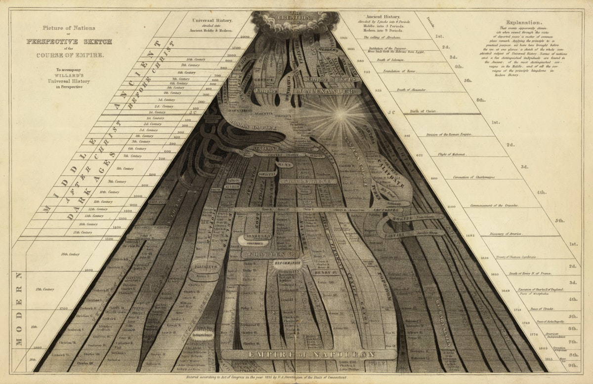
Artist: Emma Willard 
Title: Picture of Nations; or Perspective Sketch of the Course of Empire" (1836)
Source: https://publicdomainreview.org/essay/emma-willard-maps-of-time
License: Cartography Associates: CC BY-NC-SA 3.0
Filename: 4545001-edit-small-4.jpg

---

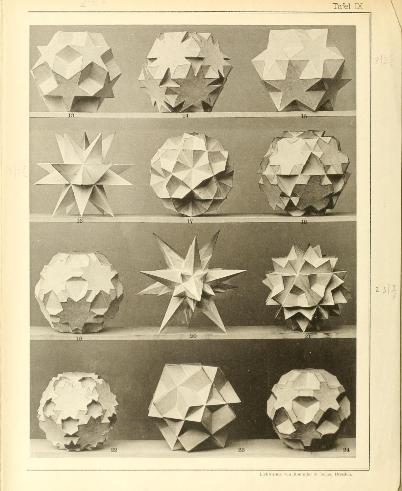
Artist: Max Brückner
Title: Vielecke und Vielflache, Theorie und Geschichte
Source: https://archive.org/details/vieleckeundvielf00bruoft/page/n259/mode/2up
License: Public domain
Filename: vieleckeundvielf00bruoft_0286.jpg

---

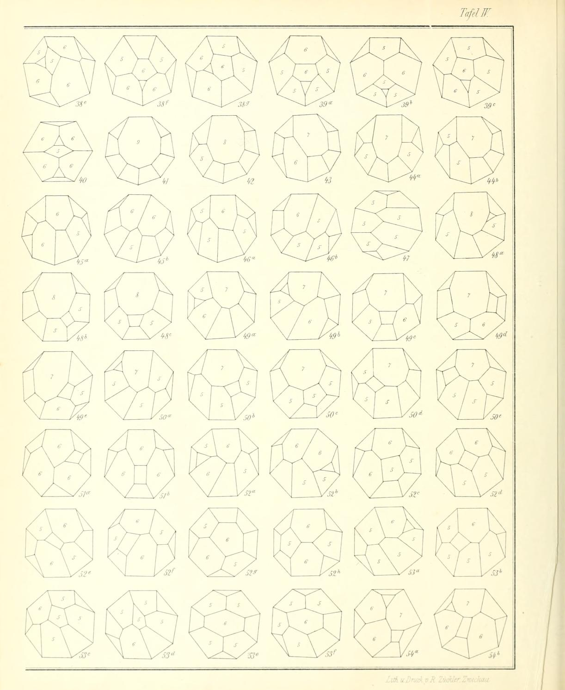
Artist: Max Brückner
Title: Vielecke und Vielflache, Theorie und Geschichte
Source: https://archive.org/details/vieleckeundvielf00bruoft/page/n259/mode/2up
License: Public domain
Filename: vieleckeundvielf00bruoft_0274.jpg

---

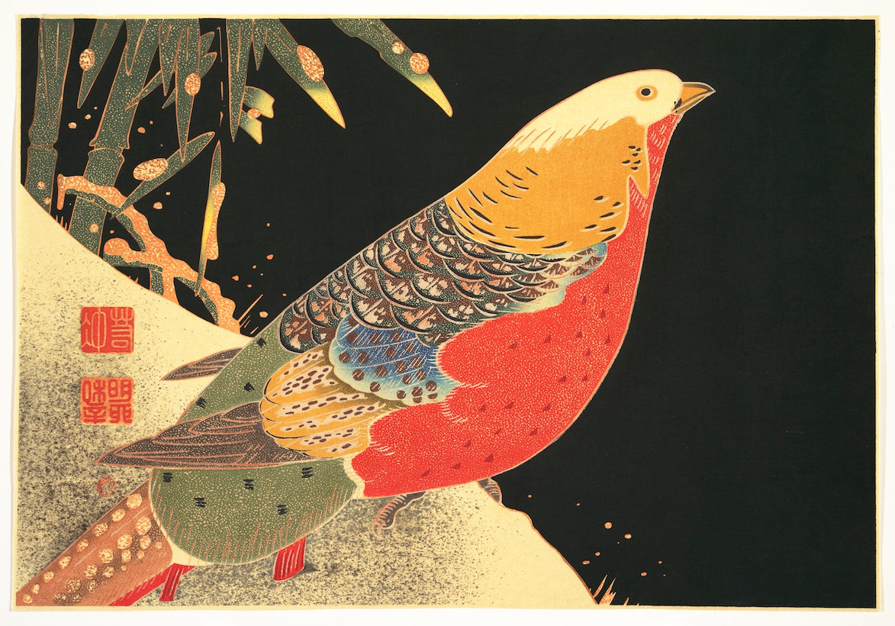
Artist: Itō Jakuchū
Title: Golden Pheasant in the Snow
Source: https://www.metmuseum.org/art/collection/search/57124
License: Attribution 4.0 International (CC BY 4.0)
Filename: 45144302675_d9be470dbf_o.jpg

---

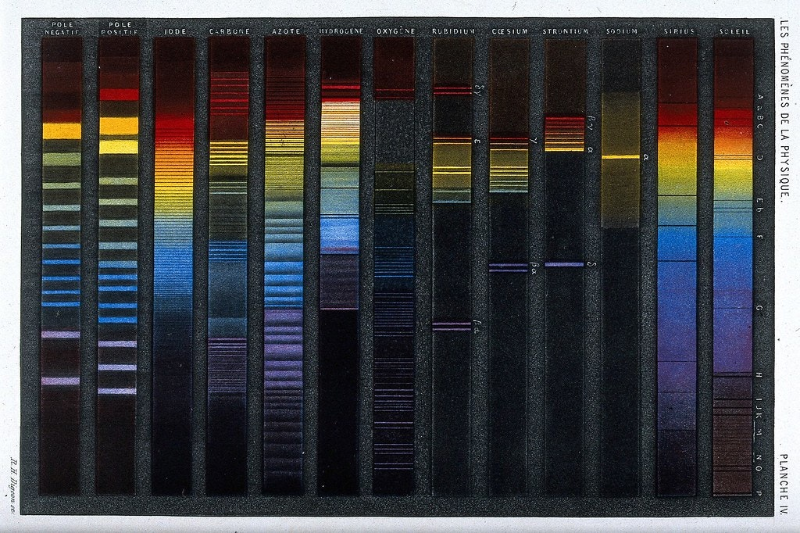
Artist: R.H. Digeon
Title: Optics: spectra of various substances. ca. 1868
Source: https://wellcomecollection.org/works/g62v5g5r
License: Wellcome Collection. Attribution 4.0 International (CC BY 4.0)
Filename: 48179459756_c6d42d22b3_b.jpg

---

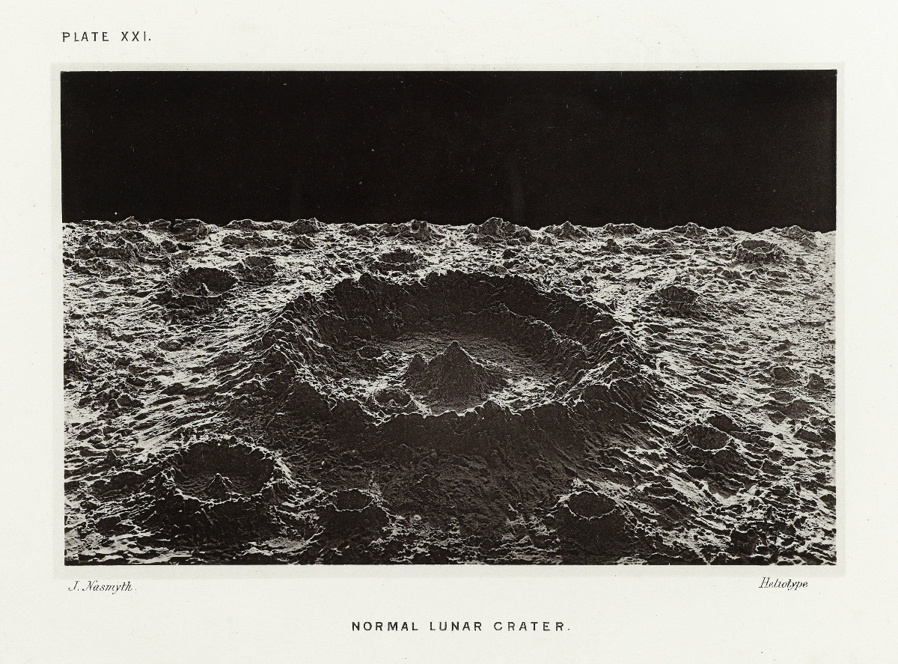
Artist: James Nasmyth
Title: Normal Lunar Crater
Source: http://hdl.handle.net/10934/RM0001.COLLECT.479722
License: Public domain
Filename: 32118188068_f1e8cf20cc_o.jpg

---

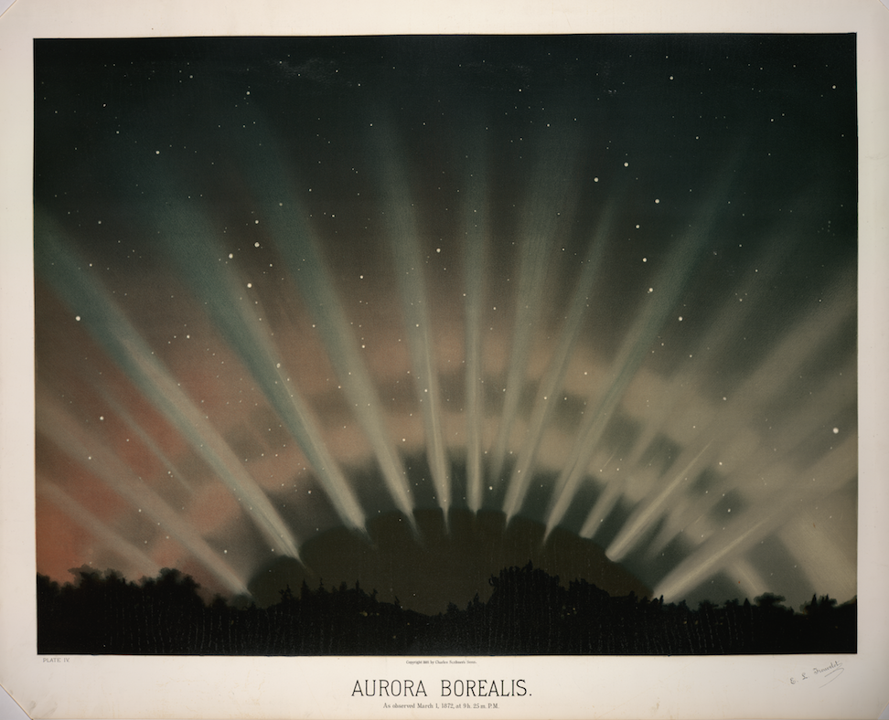
Artist: Étienne Léopold Trouvelot
Title: Aurora Borealis (1882)
Source: https://digitalcollections.nypl.org/items/510d47dd-e6cd-a3d9-e040-e00a18064a99
License: Public domain
Filename: 30834319103_7bd5fa7b18_o.png

---

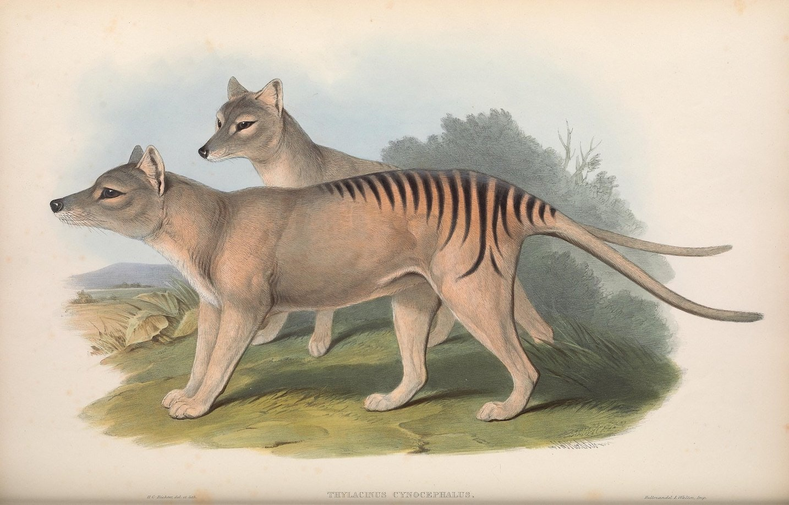
Artist: John Gould
Title: Thylacinus cynocephalus, Thylacine (now extinct) - Mammals of Australia (1845–63)
Source: https://publicdomainreview.org/collection/john-gould-mammals-of-australia
License: Public domain
Filename: 27011087510_8681578b0e_k.jpg

---

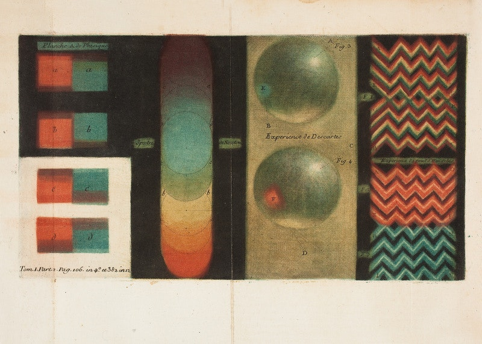
Artist: Jacques-Fabien Gautier
Title: Color chart
Source: https://publicdomainreview.org/collection/colour-wheels-charts-and-tables-through-history
License: Public domain
Filename: 22440853713_1c060a9e6c_o.jpg

---

Title: Plan of the Bronx International Exposition, East 177th Street, Borough of the Bronx, New York City
Source: https://digitalcollections.nypl.org/items/debd1770-010c-0131-4ca6-58d385a7bbd0
Filename: nypl.digitalcollections.debd1770-010c-0131-4ca6-58d385a7bbd0.001.v.jpg

---

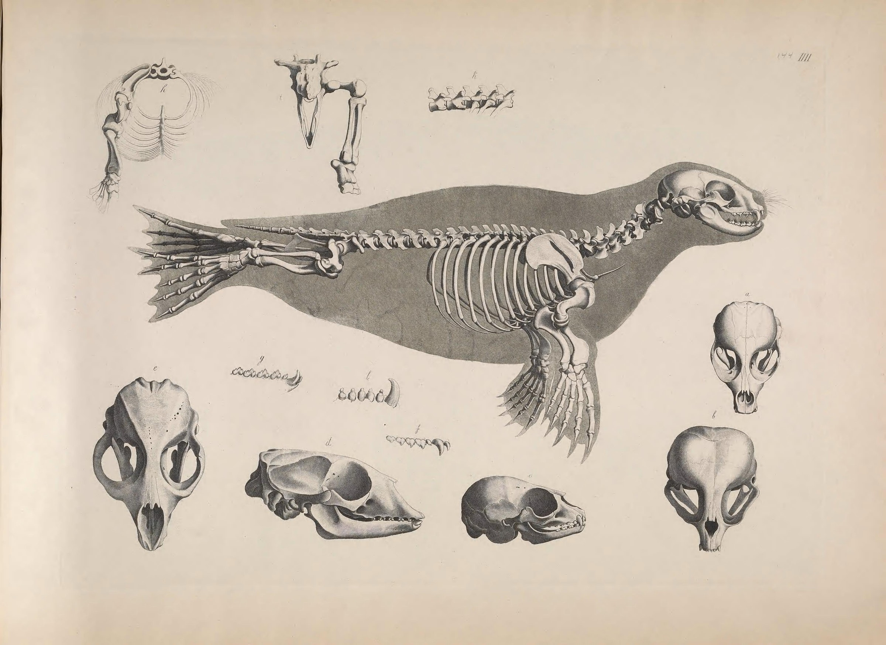
Artist: Edouard Joseph d’Alton
Title: Illustrations of Animal Skeletons (1821–1838)
Source: https://publicdomainreview.org/collection/comparative-osteology
License: Public domain
Filename: vergleichendeOs00Pand_0299.jpg